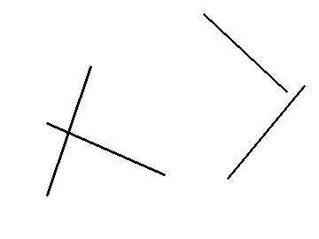

# Hough line
Detect lines in the image using the Hough transform.

## Build project
Build project with cmake:
```
cd build
cmake -DCMAKE_BUILD_TYPE=Release ..
make
```

## Run project
Run hough line detection:
```
./hough_line <image_file>
```

For example:
```
./hough_line edges.png
```
<p align="center">
    
</p>

<p align="center">
    Edges.
</p>

The result will be like this:
```
(rho, theta) = (121, 0.331613)
(rho, theta) = (105, 1.98968)
(rho, theta) = (327, 0.680678)
(rho, theta) = (145, 5.46288)
```
