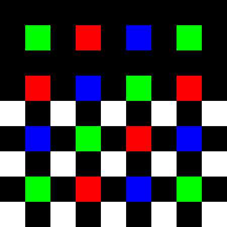
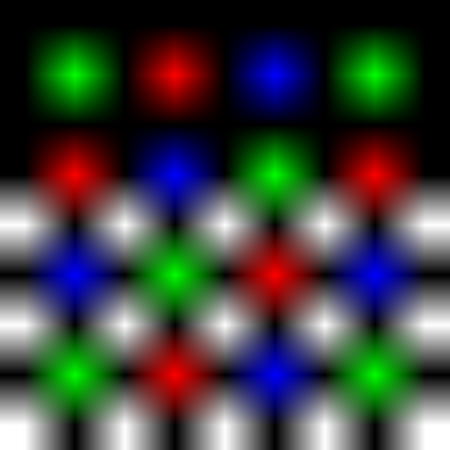

# Image interpolation
Image interpolation algorithms for image scaling.

## Build project
Build project with cmake:
```
cd build
cmake -DCMAKE_BUILD_TYPE=Release ..
make
```

## Run project
Run the image interpolation:
```
./image_interpolation <image_file> <scale>
```

For example:
```
./image_interpolation 00.png 50
```

The results will be similar to these:

<p align="center">
    
</p>
<p align="center">
    Nearest neighbour interpolation.
</p>

<p align="center">
    
</p>
<p align="center">
    Bilinear interpolation.
</p>

<p align="center">
    
</p>
<p align="center">
    Bicubic interpolation.
</p>
